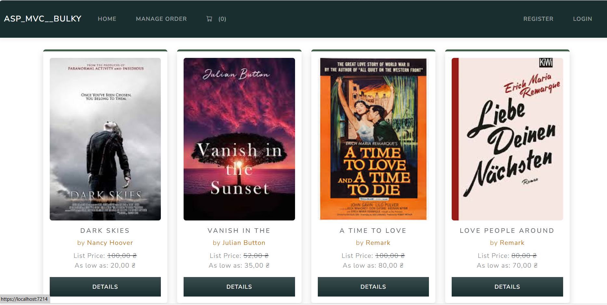
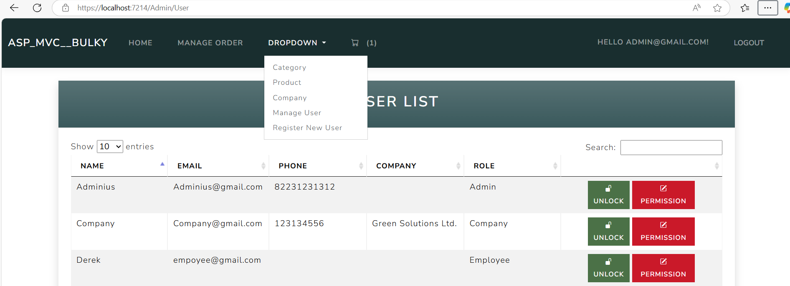
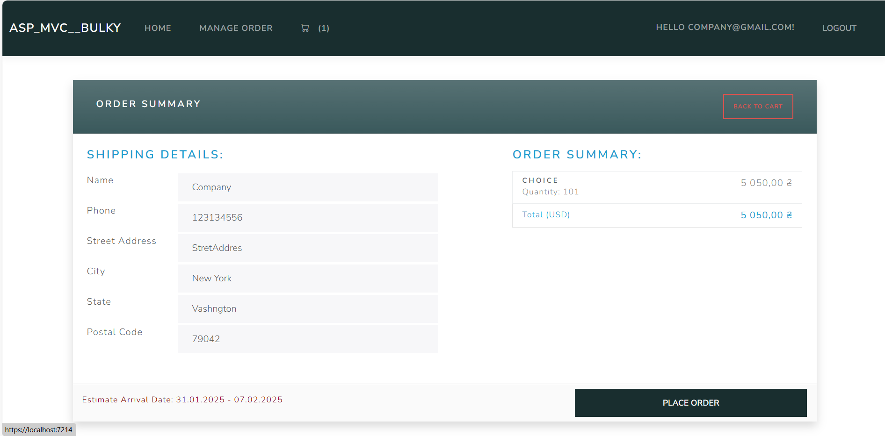

# Bulky Book - ASP.NET Core MVC Project

This is a full-stack web application built using **ASP.NET Core MVC (.NET 8)**. The project was created based on a Udemy course to understand the fundamental and advanced concepts of ASP.NET Core, including Razor Pages, Identity Framework, Entity Framework, and more.

## Features

- ASP.NET Core MVC (.NET 8) and Razor Pages
- Authentication & Authorization: Role-based access with Identity Framework
- Stripe Payment Integration for seamless transactions
- Entity Framework Core with PostgreSQL (code-first approach)
- Custom Tag Helpers, Partial Views, and View Components
- Session Management and `TempData` for better user experience
- Database seeding with automatic migrations
- Repository Pattern for data access

---

## Screenshots

### User View


### Admin View


### Card View



---

## Prerequisites

To run this project locally, you need to have the following installed:

1. **.NET 8 SDK**  
2. **PostgreSQL**: Ensure you have a PostgreSQL server running locally or on the cloud.  

Additionally, you'll need to configure the `appsettings.json` file before running the application.

### Example `appsettings.json`
```json
{
  "ConnectionStrings": {
    "DefaultConnection": "Host=your_host;Database=your_database;Username=your_username;Password=your_password"
  },
  "Stripe": {
    "SecretKey": "your_stripe_secret_key",
    "PublishableKey": "your_stripe_publishable_key"
  }
}
```

Place the `appsettings.json` file in the `src/Restaurants.API/bin/Debug/net8.0` directory or wherever your build outputs are located.

---

## How to Run Locally

1. Clone this repository

2. Install dependencies

3. Add appsettings.json file to project

4. Apply migrations and seed the database

5. Run the application

6. Access the app in your browser at `http://localhost:5000`.

---

## Technologies Used

- **ASP.NET Core MVC** (.NET 8)
- **PostgreSQL** for database
- **Bootstrap v5** for responsive UI
- **Entity Framework Core** for ORM
- **Stripe API** for payment processing

---

## Acknowledgements

This project is based on the concepts learned in the Udemy course. Special thanks to the instructor for providing a comprehensive understanding of ASP.NET Core.

---

## License

This project is open-source and available under the MIT License. Feel free to use and modify it for your own purposes.

---

## Contact

If you have any questions or suggestions, feel free to reach out:

- **GitHub**: [andrunovostavskyi](https://github.com/andrunovostavskyi)
- **LinkedIn**: https://www.linkedin.com/in/andriy-novostavskyi-073879325/
- **Email**: novostavskuy@gmail.com
